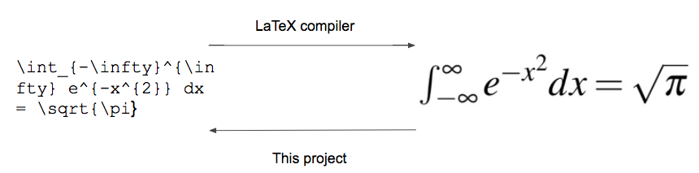

# TeXGen

The aim of this project is to perform optical character recognition (OCR) on arbitrary characters, especially mathematical symbols. In particular, given a LaTeX-formatted formula, we want to identify the symbols composing it, and return the LaTeX for those symbols:

To accomplish this task, we trained a convolutional neural network (CNN) in Keras. Using LaTeX, dvipng, and a couple Python scripts, thousands of .png files were generated of mathematical symbols. Using this data, we have so far gotten 97% accuracy on individual Greek letters.
